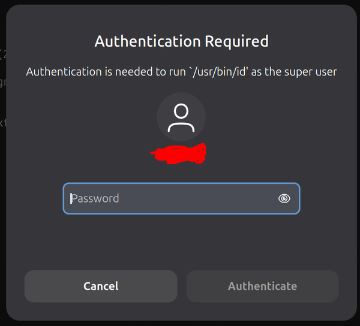
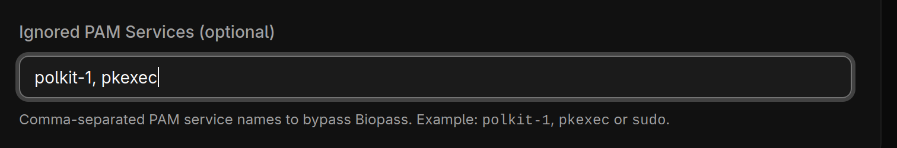

# Polkit 集成指南

简体中文 | [English](Polkit.md)

在某些桌面环境（如 GNOME 和 KDE）中，当用户编辑某些重要设置时，需要通过交互式对话框输入密码或指纹。



此流程由 [Polkit](https://github.com/polkit-org/polkit) 处理。在某些情况下，由于设备访问的严格策略，Polkit 不会触发 biopass-rs 的认证。

以下是修复该问题的步骤：

1. 为 `polkit-agent-helper` 创建 systemd 覆盖配置
    ```bash
    sudo systemctl edit 'polkit-agent-helper@.service'
    ```
2. 添加此覆盖配置，然后保存：
    ```ini
    [Service]
    PrivateDevices=no
    DevicePolicy=auto

    DeviceAllow=char-video4linux rw
    DeviceAllow=char-media rw
    DeviceAllow=char-drm rw
    DeviceAllow=/dev/uinput rw

    ProtectHome=read-only
    ```
3. 重新加载 systemd 并重启 polkit
    ```bash
    sudo systemctl daemon-reload
    sudo systemctl restart polkit.service
    ```
4. 在 biopass-rs 的 UI 中检查配置。请确保从忽略服务列表中移除 `pkexec`、`polkit-1` 
5. 最后，运行 `pkexec id` 检查相机是否打开。如果覆盖配置生效，`polkit` 认证窗口将不会打开。
