# Contributing guidelines

Welcome to biopass-rs! We appreciate your interest in contributing. This guide outlines how to get the project running locally, explains the core architecture, and provides important debugging guidelines.

## 1. How to Run

biopass-rs consists of Rust workspace crates and a frontend Tauri desktop application. You will need to install dependencies for both.

### Install Dependencies

**For Linux system dependencies:**

Ubuntu/Debian:
```bash
sudo apt update
sudo apt install libpam0g-dev libv4l-dev fprintd libwebkit2gtk-4.1-dev build-essential curl wget file libxdo-dev libssl-dev libayatana-appindicator3-dev librsvg2-dev
```

Fedora:
```bash
sudo dnf install -y gtk3-devel gdk-pixbuf2-devel webkit2gtk4.1-devel libv4l-devel pam-devel librsvg2-devel xdotool-devel libayatana-appindicator-gtk3-devel rpm-build nasm
```

**For Rust and frontend tools:**

You need to install [Bun](https://bun.sh/), Rust/Cargo, and mise.
```bash
# Install Bun
curl -fsSL https://bun.sh/install | bash

# Install Rust
curl --proto '=https' --tlsv1.2 -sSf https://sh.rustup.rs | sh
```

### Building the Project

The root directory includes `mise.toml` tasks that orchestrate the entire build process.

To build the Rust auth module:
```bash
mise run build-auth
```

To build both the Rust auth module and the Tauri frontend:
```bash
mise run build
```

To package the application into Linux release artifacts (`.deb` and `.rpm`)
```bash
mise run package
```

### Running the Desktop App in Dev Mode

To run the Tauri app locally with hot module replacement (HMR), use the following commands:
```bash
cd apps/desktop
bun install
bun run tauri dev
```

## 2. Tech Stack

biopass-rs is built using modern and reliable technologies across both the backend logic and the desktop management application.

### Backend Authentication Crates (`crates/`)
- **Rust**: System-level PAM, helper and authentication orchestration.
- **Cargo**: Build system for the auth core, helper and PAM module.
- **V4L2**: Camera capture for RGB and IR frame paths.
- **fprintd over D-Bus**: Fingerprint device management and verification.
- **tract-onnx**: Running the machine learning models (YOLO for detection, EdgeFace for recognition, MobileNetV3 for anti-spoofing).
- **Linux PAM**: Pluggable Authentication Module integration for the OS.

### Desktop Application (`apps/desktop/`)
- **Tauri v2**: Lightweight and secure desktop framework bridging the backend and frontend.
- **Rust**: Systems programming for the Tauri backend (invoking configurations, paths, etc.).
- **Vite & React**: Fast frontend UI framework for managing biometric settings.
- **TypeScript**: Type-safe logic for the UI.
- **TailwindCSS**: UI styling and layout.

## 3. Architecture and Flow

The biopass-rs system is split into two primary layers: **The Backend Authentication Module** and the **Desktop UI Engine**.

```mermaid
sequenceDiagram
    participant OS as Linux Login/Sudo (PAM)
    participant Lib as libbiopass_rs_pam.so
    participant Helper as biopass-rs-helper
    participant Sensors as Camera/Mic/Fingerprint
    participant TauriBackend as Tauri Rust Backend
    participant ReactUI as React Frontend

    rect rgb(30, 41, 59)
    Note over OS,Sensors: Backend Authentication Flow
    OS->>Lib: Authenticate User
    Lib->>Helper: Spawn Isolated Process
    Helper->>Sensors: Capture Biometrics
    Sensors-->>Helper: Return Data
    Helper->>Helper: Run Local Inference
    Helper-->>Lib: Return Exit Code (0 for Success)
    Lib-->>OS: PAM_SUCCESS or PAM_AUTH_ERR
    end

    rect rgb(31, 41, 55)
    Note over TauriBackend,ReactUI: Desktop Management Flow
    ReactUI->>TauriBackend: Update Config/Register Biometrics
    TauriBackend->>Sensors: Capture Biometrics
    Sensors-->>TauriBackend: Return Reference Data
    TauriBackend-->>ReactUI: Save to ~/.../config.yaml
    end
```



### The PAM Module (`crates/biopass-rs-pam/`)

### Directory Structure

The repository is organized by separating the backend systems-level logic from the frontend desktop application logic.

```text
biopass-rs/
├── apps/
│   └── desktop/          # The Tauri desktop application
│       ├── src/          # React frontend (Vite + TypeScript + Tailwind)
│       └── src-tauri/    # Rust backend bridging system calls and the UI
│
├── crates/
│   ├── biopass-rs-auth/     # Rust auth core and helper binary
│   └── biopass-rs-pam/      # Linux PAM module
│
├── assets/
│   └── models/face/      # Face detection, recognition and anti-spoofing models
│
├── docs/                 # Documentation (Contributing, Architecture)
├── Cargo.toml            # Cargo workspace definition
└── mise.toml             # Root task orchestrator (calls Cargo and Tauri build commands)
```

## 4. Development Warnings and Debugging

When you need to modify the Rust PAM logic, we recommend you enable the `debug` flag in the configuration. You may open the UI app and toggle **Debug Mode** to ON, or manually edit `~/.config/biopass-rs/config.yaml`. When the debug flag is enabled, detailed logs are printed, and face captures that fail authentication (or get caught spoofing) are saved as `.bmp` images to `~/.local/share/biopass-rs/debugs/`.

Face authentication runs several ONNX models for detection, recognition and anti-spoofing. In Rust debug builds, those model loading and inference paths are expected to be much slower than the packaged application or a release helper build. Use release mode when comparing authentication latency or investigating face performance:

```bash
mise run build
biopass-rs-helper auth --service login --username "$USER"
```

### ⚠️ System Lockout Warnings

Editing your distro PAM include file (typically `/etc/pam.d/common-auth` on Debian/Ubuntu or `/etc/pam.d/system-auth` on Fedora) incorrectly may **lock you out of your system permanently**. Be extremely careful when manually testing new PAM libraries. Use one of the following methods to prevent lockout:

- Use a Virtual Machine: It is strongly recommended to use a Linux VM (e.g QEMU + KVM) for development. This allows you to take snapshot rollbacks if a module crashes or corrupts the PAM stack. Notice that fingerprint devices usually cannot be passed through to a virtual machine.
- Grant write permission to the PAM file you are testing, for example: `sudo chown $USER:root /etc/pam.d/common-auth` and `sudo chmod 644 /etc/pam.d/common-auth`.
- Rescue USB: Use a rescue USB to mount the filesystem and manually fix the configuration files if you accidentally reboot into a locked system.
