# 贡献指南

简体中文 | [English](contributing.md)

欢迎来到 biopass-rs！感谢你有兴趣参与贡献。本指南介绍如何在本地把项目跑起来，解释核心架构，并给出重要的调试注意事项。

## 1. 如何运行

biopass-rs 由 Rust workspace crate 和前端 Tauri 桌面应用组成。系统库和语言工具链（Rust、Bun、Node 等）都需要安装，而 [mise](https://mise.jdx.dev/) 通过 `mise.toml` 统一编排这一切。

### 安装依赖

**1. Linux 系统依赖：**

Ubuntu/Debian：
```bash
sudo apt update
sudo apt install libpam0g-dev libv4l-dev fprintd libwebkit2gtk-4.1-dev build-essential curl wget file libxdo-dev libssl-dev libayatana-appindicator3-dev librsvg2-dev
```

Fedora：
```bash
sudo dnf install -y gtk3-devel gdk-pixbuf2-devel webkit2gtk4.1-devel libv4l-devel pam-devel librsvg2-devel xdotool-devel libayatana-appindicator-gtk3-devel rpm-build nasm
```

**2. 信任项目并用 mise 安装语言工具链：**

`mise.toml` 在 `[tools]` 里固定了 Rust、Bun、Node、Vite+ 和 git-lfs 的精确版本。安装好 [mise](https://mise.jdx.dev/getting-started.html) 后，信任配置并一步装齐所有工具链即可——无需单独跑 rustup 或 Bun 的安装脚本：

```bash
mise trust
mise install        # 简写：mise i
```

### 开发工作流

所有开发任务都定义在 `mise.toml` 里。开发任务会把你的工作隔离到仓库根目录下的 `dev-data/` 目录（由 `mise.toml` 设置的 `BIOPASS_DATA_DIR` / `BIOPASS_CONFIG` 环境变量驱动），因此不会碰到你真实的 `~/.config/biopass-rs` 或 `~/.local/share/biopass-rs`。

**1. 初始化开发数据目录** —— 写入默认配置、下载 ONNX 模型，并从上游 `biopass` 安装导入已注册的人脸：

```bash
mise run dev-helper install
```

这会在 `dev-data/` 下生成 `config.yaml`、`models/` 和 `faces/`。

**2. 运行桌面应用** —— 以开发模式启动 Tauri 应用（带 HMR），并指向 `dev-data/` 下的配置：

```bash
mise run dev-app
```

**3. 跑一次端到端认证流程** —— 模拟 `sudo` 触发的场景，执行一次完整的认证尝试：

```bash
mise run dev-helper auth -s sudo
```

想要更干净地反复测试，可以用封装好的任务，它会先清空已捕获的帧，再执行认证：

```bash
mise run auth-test
```

两者都会把认证失败时捕获的 RGB/IR 帧写入 `dev-data/debugs/`，方便你查看模型实际看到的原始画面。

**4. 提交前** —— 跑完整的检查套件（Rust 的 `cargo check` + `clippy` + `fmt --check` + 测试，以及前端的 `vp check`）：

```bash
mise run check
```

如果有任何失败，`mise run fix` 会尽可能自动修复格式和 clippy lint 问题。

### 构建项目

构建 Rust 认证模块：

```bash
mise run build-auth
```

同时构建 Rust 认证模块和 Tauri 前端：

```bash
mise run build
```

打包成 Linux 发布产物（`.deb` 和 `.rpm`）：

```bash
mise run package
```

## 2. 技术栈

biopass-rs 在后端逻辑和桌面管理应用两侧都采用了现代、可靠的技术。

### 后端认证 Crate（`crates/`）
- **Rust**：系统级 PAM、helper 与认证编排。
- **Cargo**：认证核心、helper 和 PAM 模块的构建系统。
- **V4L2**：RGB 和 IR 帧的摄像头采集。
- **fprintd（经 D-Bus）**：指纹设备的管理与验证。
- **tract-onnx**：运行机器学习模型（YOLO 做检测、EdgeFace 做识别、MobileNetV3 做防伪）。
- **Linux PAM**：与操作系统的可插拔认证模块集成。

### 桌面应用（`apps/desktop/`）
- **Tauri v2**：轻量、安全的桌面框架，桥接后端与前端。
- **Rust**：Tauri 后端的系统编程（调用配置、路径等）。
- **Vite & React**：用于管理生物识别设置的快速前端 UI 框架。
- **TypeScript**：UI 的类型安全逻辑。
- **TailwindCSS**：UI 样式与布局。

## 3. 架构与流程

biopass-rs 系统分为两个主要层次：**后端认证模块**和**桌面 UI 引擎**。

```mermaid
sequenceDiagram
    participant OS as Linux 登录/Sudo (PAM)
    participant Lib as libbiopass_rs_pam.so
    participant Helper as biopass-rs-helper
    participant Sensors as 摄像头/麦克风/指纹
    participant TauriBackend as Tauri Rust 后端
    participant ReactUI as React 前端

    rect rgb(30, 41, 59)
    Note over OS,Sensors: 后端认证流程
    OS->>Lib: 认证用户
    Lib->>Helper: 拉起隔离进程
    Helper->>Sensors: 采集生物特征
    Sensors-->>Helper: 返回数据
    Helper->>Helper: 本地推理
    Helper-->>Lib: 返回退出码（0 表示成功）
    Lib-->>OS: PAM_SUCCESS 或 PAM_AUTH_ERR
    end

    rect rgb(31, 41, 55)
    Note over TauriBackend,ReactUI: 桌面管理流程
    ReactUI->>TauriBackend: 更新配置 / 注册生物特征
    TauriBackend->>Sensors: 采集生物特征
    Sensors-->>TauriBackend: 返回参考数据
    TauriBackend-->>ReactUI: 保存到 ~/.../config.yaml
    end
```



### PAM 模块（`crates/biopass-rs-pam/`）

### 目录结构

仓库按后端系统级逻辑与前端桌面应用逻辑分离的方式组织。

```text
biopass-rs/
├── apps/
│   └── desktop/          # Tauri 桌面应用
│       ├── src/          # React 前端（Vite + TypeScript + Tailwind）
│       └── src-tauri/    # 桥接系统调用与 UI 的 Rust 后端
│
├── crates/
│   ├── biopass-rs-auth/     # Rust 认证核心与 helper 二进制
│   └── biopass-rs-pam/      # Linux PAM 模块
│
├── assets/
│   └── models/face/      # 人脸检测、识别与防伪模型
│
├── docs/                 # 文档（贡献指南、架构等）
├── Cargo.toml            # Cargo workspace 定义
└── mise.toml             # 根任务编排器（调用 Cargo 与 Tauri 构建命令）
```

## 4. 开发注意事项与调试

当你需要修改 Rust PAM 逻辑时，建议在配置里开启 `debug` 标志。你可以打开 UI 应用把 **Debug Mode** 切到 ON，或者手动编辑 `~/.config/biopass-rs/config.yaml`。debug 标志开启后会打印详细日志，并把认证失败（或被判定为欺骗）的人脸采集以 `.bmp` 图片保存到 `~/.local/share/biopass-rs/debugs/`。

人脸认证会运行多个 ONNX 模型来完成检测、识别和防伪。在 Rust debug 构建下，这些模型的加载和推理路径会比打包后的应用或 release helper 构建慢得多。在对比认证延迟或排查人脸性能时，请使用 release 模式：

```bash
mise run build
biopass-rs-helper auth --service login --username "$USER"
```

### ⚠️ 系统锁死警告

错误地修改发行版的 PAM include 文件（Debian/Ubuntu 上通常是 `/etc/pam.d/common-auth`，Fedora 上通常是 `/etc/pam.d/system-auth`）可能会**永久把你锁在系统外**。手动测试新的 PAM 库时务必格外小心。可以用下面任一方法防止锁死：

- 使用虚拟机：强烈建议用 Linux 虚拟机（例如 QEMU + KVM）进行开发。这样在模块崩溃或破坏 PAM 栈时可以快照回滚。注意指纹设备通常无法透传给虚拟机。
- 给正在测试的 PAM 文件加写权限，例如：`sudo chown $USER:root /etc/pam.d/common-auth` 和 `sudo chmod 644 /etc/pam.d/common-auth`。
- 救援 U 盘：如果不小心重启进了锁死状态，用救援 U 盘挂载文件系统并手动修复配置文件。
